<h1 align="center">Hi, I'm Yoshiki 👋</h1>

  Frontend-leaning Full-stack ｜ Tokyo, JP  
  Vue / React / Next.js × Laravel / PHP / WordPress

<!-- 技術バッジ -->

  
  
  
  
  
  
  
  
  
  
  

---

## 🧩 Featured Projects
- **[REFLEC BEAT plus Lv11 Rank Manager](https://github.com/misato729/rbplus-rank-manager)**  
  🎮 Vue 3 + TS + Pinia × Laravel 12 + Sanctum  
  難易度表＆スコア管理（126曲対応） / 認証・目標進捗・FCハイライト・CSV連携  
  [本番サイト](https://rbplus-rank-manager.site/) ｜  
  [Frontend](https://github.com/misato729/score-manager-frontend) ｜ [Backend](https://github.com/misato729/score-manager-backend)

- **[Markdown対応メモアプリ](https://github.com/misato729/Next-MemoApp)**  
  📝 Next.js + TypeScript ｜ Markdownプレビュー・検索・デバウンス対応  
  [本番サイト](https://next-memo-app-five.vercel.app/)

- **[Portfolio Site](https://github.com/misato729/Yoshiki-Portfolio)**  
  🌐 WordPress オリジナルテーマ開発（受託想定構成）  
  [本番サイト](https://yoshiki-portfolio.com/)

---

## 📝 Writing
- [【応用情報】IT未経験の文系大学生が半年で応用情報を取った戦略と勉強法](https://qiita.com/misato729/items/0c77641c884b253e4d36) (Qiita)

---

## 🚀 Now / Next
- Now: Vue 3（Vite）× Laravel 12（Livewire併用）での開発強化  
- Next: Nuxt への移行検証、React/Next.js の深掘り、Render/Vercel 運用最適化

---

<!-- metrics 置き場（GitHub Actionsで自動更新予定） -->

  

---

  
🛠 Tech Stack（詳細）

**Frontend**: Vue 3, Pinia, Vue Router, Vite, TypeScript, React, Next.js, Tailwind  
**Backend**: Laravel 12, PHP, REST API, Livewire, Sanctum  
**DB**: SQLite / MySQL / PostgreSQL  
**Ops**: Vercel, Render, Cloudflare, GitHub Actions  
**Other**: Figma, WordPress（テーマ開発）, Streamlit(Python)

  
📬 Links

- Portfolio: [https://yoshiki-portfolio.com](https://yoshiki-portfolio.com)  
- Qiita: [@misato729](https://qiita.com/misato729)  
- GitHub: [@misato729](https://github.com/misato729)

